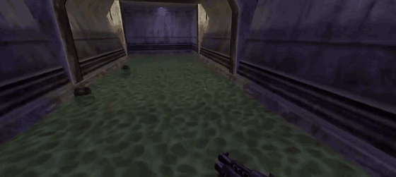
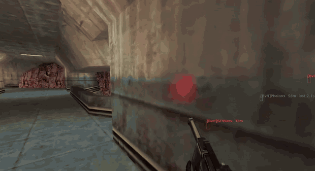
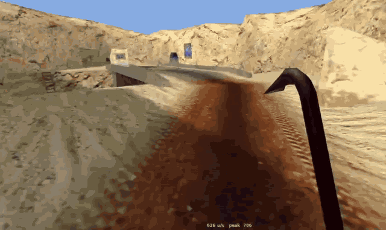

<p align="center">
  
</p>

<h1 align="center">GoldenGusTFC</h1>

A client-side ESP, aimbot and movement tool for **Team Fortress Classic** (GoldSrc, `hl.exe`, 32-bit), written as a reverse-engineering exercise against Valve's public Half-Life SDK.

The build output is still named `tfcbot.dll`.

Private repo. Built and tested against bots on a local listen server.

The interesting part of this project is not the cheat, it is that GoldSrc hands you almost everything through documented structures, so nearly none of it required guesswork. Every offset in `main.cpp` was measured by compiling a probe against the real SDK headers. Nothing was eyeballed in a debugger and hardcoded on a hunch.

---

## Demo

### ESP



Live targets draw solid red with name and distance. Targets the server has stopped sending draw dim grey with how long ago they were last seen, so a stale box never masquerades as a live one.

### Aimbot



Held on a thumb button, picking the target nearest the crosshair within 60 degrees and ignoring anything frozen. Note `[BvH]Phalanx  56m  lost 2.3` in the corner: a target the server culled two seconds ago, drawn dim and excluded from targeting.

### Bunnyhop



Holding space only. No strafe keys are being pressed: auto-strafe reads the yaw delta each input frame and supplies the matching `sidemove` itself. The speedometer bottom-centre reads current and peak horizontal speed, and is colour-coded green while gaining, red while losing, which is what makes the turn rate learnable. Scout runs at 400, so everything above that is air acceleration.

---

## How it works

GoldSrc splits the client into two modules that talk through two big tables of function pointers. Get both tables and you have the whole surface.

### `cl_enginefunc_t` — engine to client

About 130 engine functions, handed to `client.dll` when the engine calls its exported `Initialize()`. `client.dll` stores a copy in its own writable data.

We inject long after `Initialize` has run, so we go find that copy. The first 82 members are all plain functions living inside `hw.dll`, so we scan `client.dll`'s writable sections for a run of 60 or more consecutive pointers that land inside `hw.dll`'s image. That pattern is unique.

No byte signature, so it does not break when the game is patched.

Gives us: `GetLocalPlayer`, `GetEntityByIndex`, `GetPlayerInfo`, `SetViewAngles`, `FillRGBA`, `DrawConsoleString`, `PM_TraceLine`, and `pTriAPI` for `WorldToScreen`.

### `cldll_func_t` — client to engine

The reverse table, living in `hw.dll`'s writable data. The engine calls the client through it every single frame.

This one is found *exactly* rather than heuristically: slot 0 must equal `client.dll`'s exported `Initialize`, slot 3 `HUD_Redraw`, slot 14 `CL_CreateMove`. Three matches at one address is proof.

**Overwriting a slot here IS the hook.** No inline patching, no trampolines, no disassembler, no risk of landing mid-instruction. Originals are restored on unload.

### The three hooks

| Slot | Function | What we do in it |
|-----:|----------|------------------|
| 3 | `HUD_Redraw` | ESP boxes, names, distance, speedometer |
| 6 | `HUD_PlayerMove` | cache the real `onground` flag |
| 14 | `CL_CreateMove` | aimbot, auto bunnyhop, auto air-strafe |

Slot 14 is the important one for anything that affects the game. `cmd->viewangles` is what actually gets sent to the server, so writing it there is what the server acts on. Writing it *without* also calling `SetViewAngles` is silent aim: the server sees you on target, your screen never moves.

---

## Offsets

None of these are guesses. `probe.c`, `probe2.c` and `probe3.c` include the real SDK headers, compile as 32-bit, and print `offsetof()`. Re-run them if anything ever looks wrong.

**`cl_entity_t`** (`common/cl_entity.h`, sizeof 3000)

| Field | Offset |
|-------|-------:|
| `index` | 0 |
| `player` | 4 |
| `curstate.messagenum` | 700 |
| `curstate.origin` | 704 |
| `curstate.modelindex` | 728 |
| `curstate.velocity` | 800 |
| `curstate.team` | 852 |
| `curstate.onground` | 896 (**dead, see below**) |
| `origin` (interpolated) | 2888 |
| `angles` | 2900 |

**`usercmd_t`** (sizeof 52): `viewangles` 4, `forwardmove` 16, `sidemove` 20, `upmove` 24, `buttons` 30

**`playermove_t`** (sizeof 325068): `origin` 56, `velocity` 92, `flags` 184, `oldbuttons` 200, `onground` 224

**`pmtrace_t`** (sizeof 68): `fraction` 16, `endpos` 20, `ent` 48

---

## Build

Requires **Visual Studio 2022** with the *Desktop development with C++* workload (x86 toolset).

```
build.bat
```

Produces a 32-bit `tfcbot.dll`.

If it prints `LOCKED`, the previous build is still loaded in `hl.exe`. Press **END** in game to unload it, then rebuild. This is deliberate: the script used to report `BUILD OK` when the link had actually failed, which cost us two rounds of debugging a DLL that was never compiled.

`main.cpp` has **no SDK dependency**, it is self-contained. Only the probes need the SDK, and their path is hardcoded at the top of `build_probe*.bat`. Change it if your checkout lives elsewhere.

---

## Usage

Inject `tfcbot.dll` into `hl.exe` **while already in a map**. TFC is a mod, so the process is `hl.exe` regardless of which mod you are running. A console window appears showing both table addresses and the TriAPI version, which should be 1.

A small green bar with `tfcbot` under it draws in the top-left corner. That is the heartbeat: if you can see it, the hook fires and drawing works, so any problem is further downstream.

### Keys

| Key | Function |
|-----|----------|
| hold **thumb button** (mouse4/5) | aim |
| hold **SPACE** | auto bunnyhop + auto air-strafe |
| **F3** | speedometer on/off |
| **F4** | bhop mode: auto / parity / exact |
| **F5** | invert strafe direction (**do not**, see findings) |
| **F6** | auto strafe on/off |
| **F7** | aim source: interpolated / newest server position |
| **F8** | bunnyhop on/off |
| **F9** | dump the entity table to console |
| **F10** | hide frozen targets instead of dimming them |
| **F11** | snap view / silent aim |
| **F12** | aimbot on/off |
| **INSERT** | ESP on/off |
| **HOME** | wallcheck on/off (off by default, `PM_TraceLine` can be unstable) |
| **PGUP / PGDN** | aim smoothing, 1 = instant snap |
| **NUMPAD + / −** | projectile speed for lead, 0 = hitscan |
| **END** | restore hooks and unload cleanly |

---

## Findings

Things that cost real time to work out. Read this before changing anything.

### PVS culling is a hard ceiling on client-side ESP

The server decides per client which entities to transmit and drops anything outside your potentially visible set. Players in a sealed room down the hall **are not in your entity array at all**. There is nothing in memory to draw and no client-side trick recovers it.

So the ESP distinguishes live from frozen instead of pretending: watch `curstate.messagenum` and record when it last changed. Fresh targets draw solid red. Targets the server stopped sending draw dim grey with `lost 2.3s` on the label, and are dropped entirely after 6 seconds. The aimbot ignores frozen targets outright, since aiming at a stale ghost points you at empty floor.

Comparing `messagenum` against the **local player's** `messagenum` does not work and silently rejects every target. That bug cost an evening.

The only real defeat for PVS is hosting: on a listen server the mod's server DLL and its full entity list are in the same process, so there is no culling to escape. Not implemented.

### `curstate.onground` is dead, `playermove_t.onground` is not

On the local player, `curstate.onground` is pinned at `0` forever. It never reads `-1`. Any ground check built on it is broken.

The real flag is `playermove_t.onground` at +224. It is reachable because in GoldSrc the **client**, not the server, runs the movement code: the engine hands the client a `playermove_t` and `PM_Move` fills it in. So hook slot 6, read `onground` *after* calling the original, and you have the freshest ground state on the client.

A validity check of "has this field ever read something other than -1" is **not sufficient**. A field pinned at a constant passes it, and then exact-frame bhop sets the jump bit every tick and never releases it, so you get exactly one jump. Require having observed **both** states.

### Exact-frame bhop is not worth it

Peak speed over identical runs on `warpath`:

| Mode | Peak |
|------|-----:|
| exact (jump only on the landing frame) | 712 |
| parity (alternate the jump bit blindly) | 706 |

Under one percent. Noise. At normal framerates parity lands the jump fast enough that the extra ground friction never accumulates.

The slot 6 hook is kept anyway, but for a different reason than it was added: without a real ground flag, auto-strafe cannot tell whether you are airborne and applies itself on the ground too. Correctness, not speed.

### Strafe direction is confirmed, do not "fix" it

Yaw increases when turning left, and strafing left is **negative** `sidemove`. Verified in game against the speedometer. F5 exists only because this was a coin flip before it was tested.

### Do not time anything with `GetTickCount`

Its resolution is about 15.6ms, coarser than a frame. The first speedometer differenced position over `GetTickCount` deltas and undercounted by roughly a third, reading 255 for a Scout that actually runs at 400.

Read the engine's velocity instead, which needs no timing at all. Position differencing survives only as a fallback and now uses `QueryPerformanceCounter`.

### Air acceleration, and why bhop is a skill

Speed does not come from jumping. On the ground friction clamps you to your class max. In the air, acceleration is applied only to the component of your input **perpendicular** to your current velocity, which is why pushing straight forward gains nothing and why the ground cap does not apply.

So: release forward, hold one strafe key, turn the mouse the same direction, alternate. Auto-strafe picks the key for you from the sign of your yaw delta, with a dead zone so mouse noise does not make it chatter, and releases after a few quiet frames because sideways input while **not** turning bleeds speed rather than building it.

The optimal turn rate gets *slower* as you get faster, which is the entire skill and why the speedometer is colour-coded: green gaining, red losing, yellow holding. Chase green.

Reference numbers, Scout: 400 running, ~700 with a decent rhythm, 946 best so far.

### Aim

Hit registration is around 90% aiming at the **interpolated** origin, because the server rewinds players by your latency for lag compensation, which lands close to what you were rendered. F7 switches to the newest server position for comparison on fast movers.

Projectile lead solves flight time as distance over speed, iterated twice since leading changes the distance. Set 0 for hitscan (shotgun, AR, sniper) where leading actively hurts, and roughly 1100 for the rocket launcher. Grenades arc, so a straight-line predictor will not fix them.

---

## Not done

- **Target stickiness.** The aimbot re-picks every input frame, so two enemies close together make it flip between them.
- **Full-map ESP** by reading the server-side entity list while hosting a listen server. The only thing that actually defeats PVS.
- **Effect tracking.** Temp entities (explosions, tracers) are culled by PAS, which is wider than PVS, so they leak position information for players you cannot see. Hook slot 35, `HUD_TempEntUpdate`.
- **Automatic hitscan vs projectile detection** so the lead value does not have to be set by hand per weapon.

---

## Files

| File | |
|------|--|
| `main.cpp` | everything |
| `build.bat` | builds `tfcbot.dll`, 32-bit |
| `probe.c` | `cl_entity_t` offsets |
| `probe2.c` | `usercmd_t`, `pmtrace_t`, `SCREENINFO`, `hud_player_info_t`, more `entity_state_t` |
| `probe3.c` | `playermove_t` offsets |
| `build_probe*.bat` | probe builds, SDK path hardcoded here |
